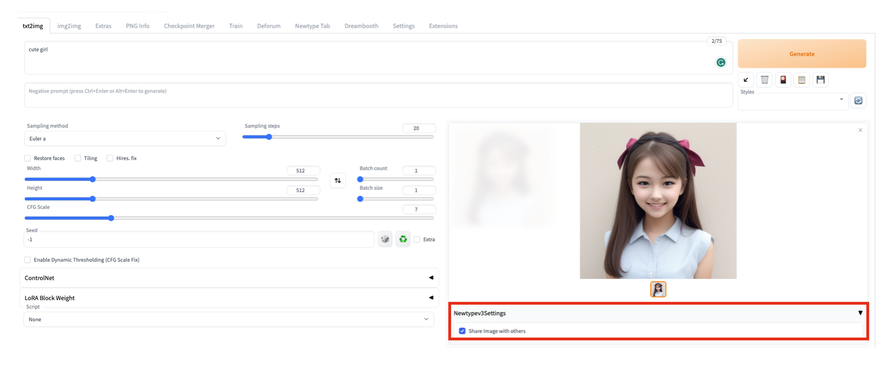
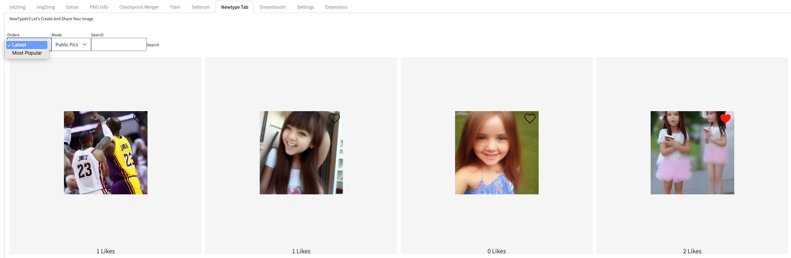
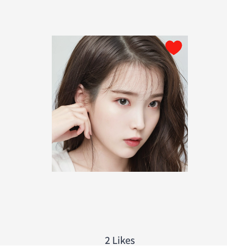
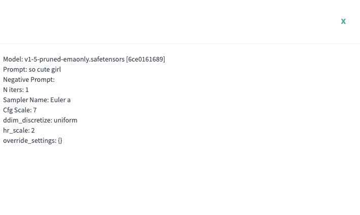

  

<h3 align="center">WebUI AI Community Extension</h3>

---

 
Web UI extension to share your knowledge and gain creativity!
      

## 🧐 About 

We found out that lot of people having trouble sharing their knowledge and creativity.
We built a WebUI extensions where users can share their pictures with other WebUI users. 

### How to Use & Features
- Check to use the settings or Not inside tab
 

- You can search image you needs
 

- You can click like button on image you like or get feedbacks from users.
 

- You can also check prompts on each image by other people.
  

### Todo & Further Features. 

- We want to support a image producers by adding a sponsor features to pouplar images. 
- We also planned to extend community functions by adding comments on each functions. 
- Any suggestions are welcomed. Please leave us your comments.
