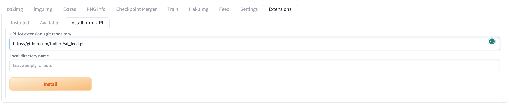
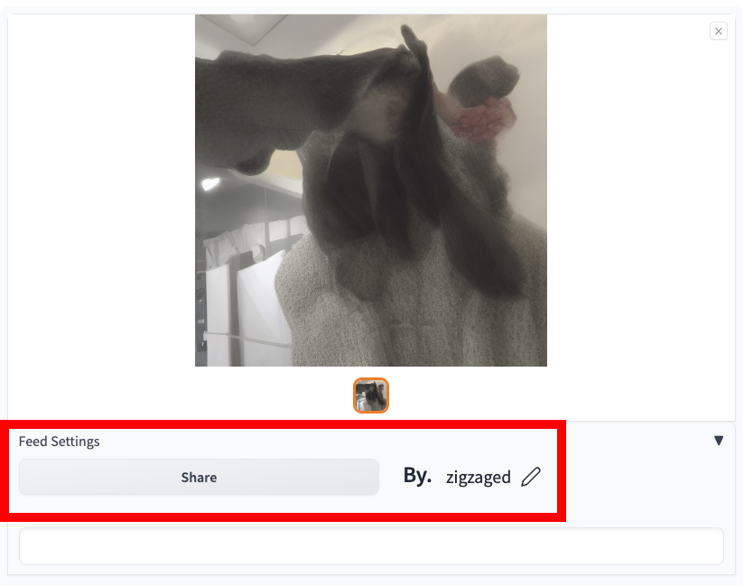
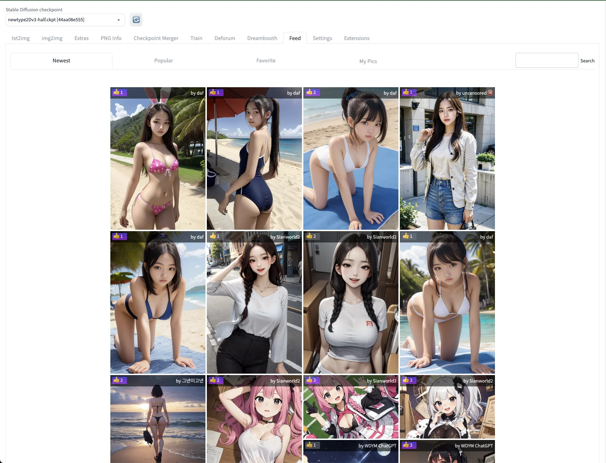
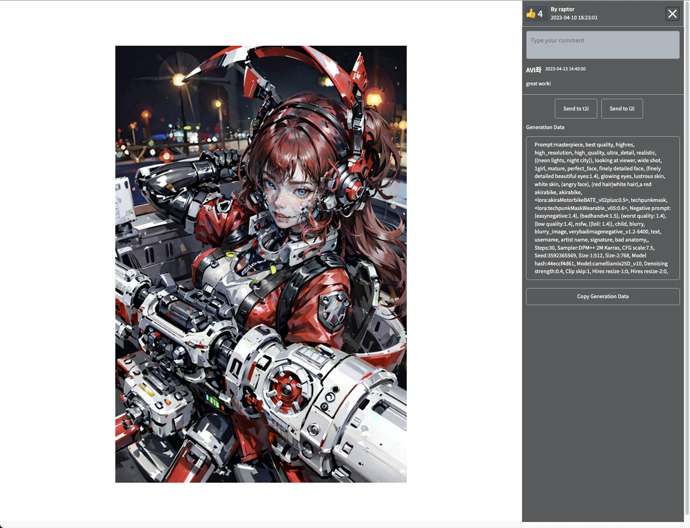
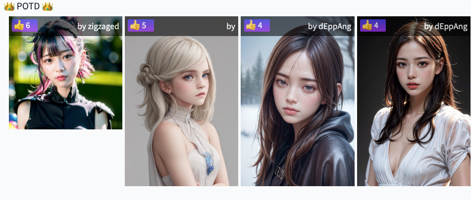

## Feed

 
 

- This is a custom extension for AUTOMATIC1111/stable-diffusion-webui.
- You can enjoy browsing from tab and getting reputation with your pictures

### Installation
- The extension can be installed directly from within the **Extension** tab within the Webui.
- You can also install it manually by running the following command from within the webui directory:

  git clone https://github.com/todhm/sd_feed.git

  and restart your stable-diffusion-webui, then you can see the new tab "Feed", and other features on txt2img tab and img2img tab.

  

### Introduction
- You can **upload** your masterpiece on the Feed Tap. 
- You can press the recommend button on the photos created by others.
- You can see **Pics Of The Day**(POTD) which is most recommended today. 
- You can easily check the generation data of your favorite photos.
- You can easily Send your favorite photos to t2i or i2i.

### Features
#### Upload Your Masterpiece! 
 

Upload your image right after generation!

### Feed
 

Browse People's images!

there are four feeds
- newest : pics of all over the world
- popular : pics what people like
- favorite : pics that you pushed like button
- my pics : that you uploaded

### Tweak!
 

Check the parameters and generate your own!

You can easily send to t2i,i2i or Copy the Generation data and also communicate!

### Pics Of The Day!📷
 
you can be the king of the day!

most popular pic of the day will be exhibited on generation tab!

#### Getting Started
To start using our WebUI Extension for Reputation-Based Feed Sharing, simply install the extension on your browser and create an account. You can then start uploading your feed and browsing other people's feed and prompts.

#### Feedback and Support
We are constantly improving our extension based on user feedback, so please let us know if you have any suggestions or issues. You can contact us at 

---
### Warning
- Your uploaded image might be exposed to our promotion contents.
- It does not mean we will make a profit from your contents. There is possibility that other people might see your content indirectly when we trying to introduce our feed to other people.

### Todo & Further Features. 

- We want to support a image producers by adding a sponsor features to pouplar images. 
- We also planned to extend community functions by adding comments on each functions. 
- Any suggestions are welcomed. Please leave us your comments.

