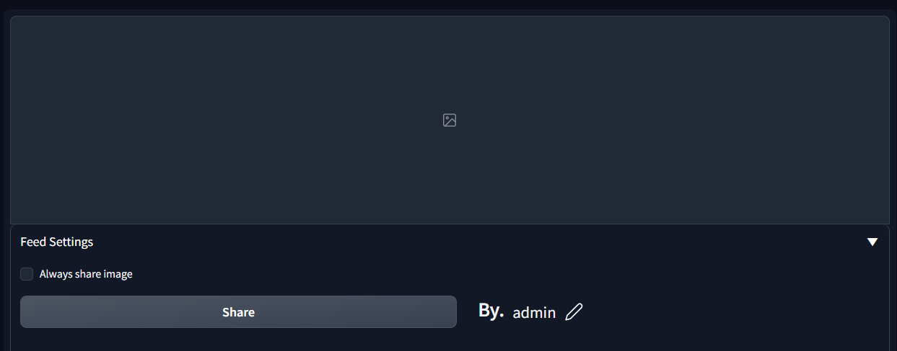
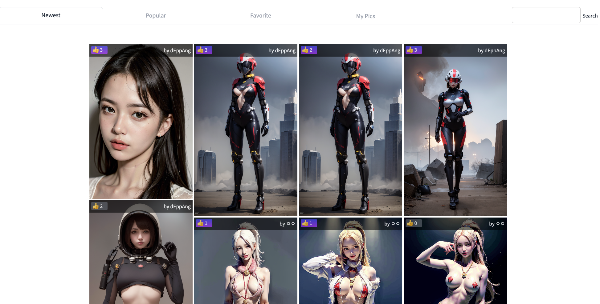

## Feed

 
 

A custom extension for AUTOMATIC1111/stable-diffusion-webui.

### Intallation
- ~~The extension can be installed directly from within the **Extenthin** tab within the Webui.~~
- You can also install it manually by running the following command from within the webui directory:

  git clone https://github.com/todhm/sd_feed.git

  and restart your stable-diffusion-webui, then you can see the new tab "Feed", and other features.

### Introduction
- Our extension allows you to upload your feed and receive feedback and reputation from other users. You can also browse and discover other people's feed and prompts to get inspired and engage with the community.

### Features
####Feed sharing: 
Share your feed with the community and receive reputation based on the feedback you receive from other users.
 

#### Prompt browsing: 
Discover other people's feed and prompts to get inspired and engage with the community.
 

#### Reputation system: 
Earn reputation points based on the quality of your feed and your engagement with the community.
 

#### User profiles: 
Customize your profile with your nickname and bio to showcase your personality and style.

#### User feedback: 
Receive feedback from other users to improve your feed and grow your reputation.

#### Getting Started
To start using our WebUI Extension for Reputation-Based Feed Sharing, simply install the extension on your browser and create an account. You can then start uploading your feed and browsing other people's feed and prompts.

#### Feedback and Support
We are constantly improving our extension based on user feedback, so please let us know if you have any suggestions or issues. You can contact us at 

  

---

### Todo & Further Features. 

- We want to support a image producers by adding a sponsor features to pouplar images. 
- We also planned to extend community functions by adding comments on each functions. 
- Any suggestions are welcomed. Please leave us your comments.
